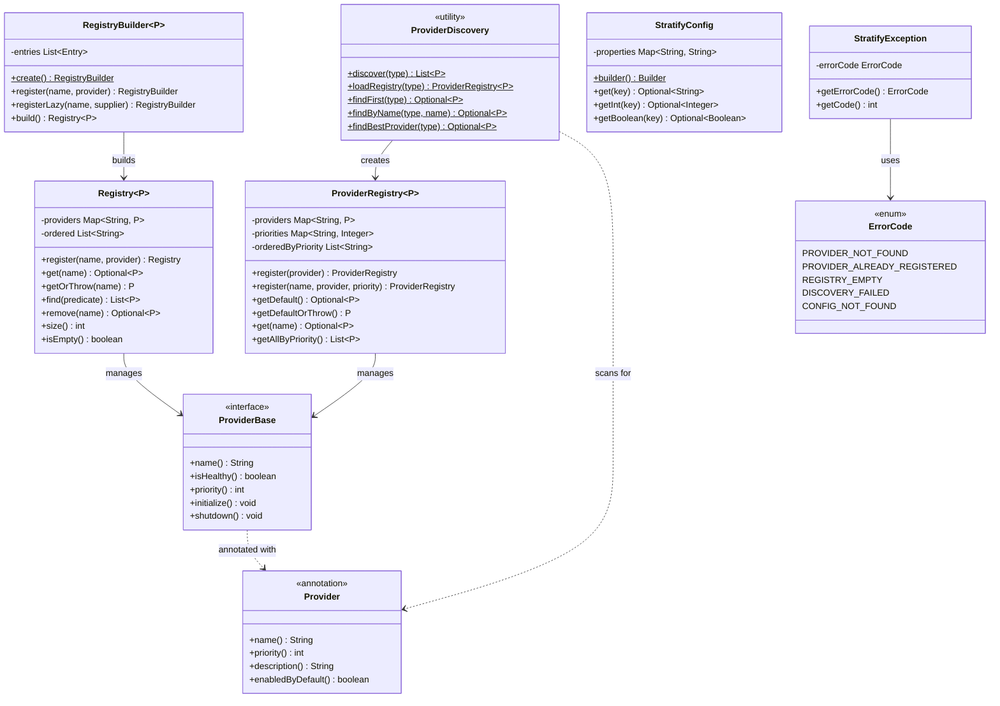
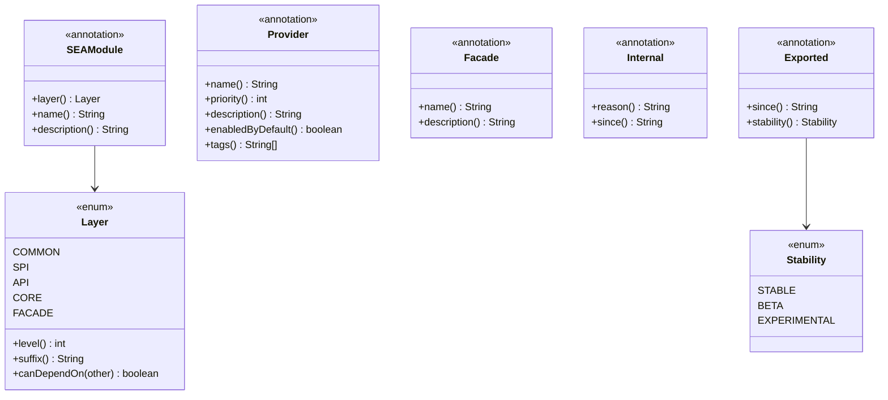

# Stratify Core Class Diagram

```mermaid
classDiagram
    class ProviderBase {
        <<interface>>
        +name() String
        +isHealthy() boolean
        +priority() int
        +initialize() void
        +shutdown() void
    }

    class Provider {
        <<annotation>>
        +name() String
        +priority() int
        +description() String
        +enabledByDefault() boolean
    }

    class Registry~P~ {
        -providers Map~String, P~
        -ordered List~String~
        +register(name, provider) Registry
        +get(name) Optional~P~
        +getOrThrow(name) P
        +find(predicate) List~P~
        +remove(name) Optional~P~
        +size() int
        +isEmpty() boolean
    }

    class ProviderRegistry~P~ {
        -providers Map~String, P~
        -priorities Map~String, Integer~
        -orderedByPriority List~String~
        +register(provider) ProviderRegistry
        +register(name, provider, priority) ProviderRegistry
        +getDefault() Optional~P~
        +getDefaultOrThrow() P
        +get(name) Optional~P~
        +getAllByPriority() List~P~
    }

    class RegistryBuilder~P~ {
        -entries List~Entry~
        +create()$ RegistryBuilder
        +register(name, provider) RegistryBuilder
        +registerLazy(name, supplier) RegistryBuilder
        +build() Registry~P~
    }

    class ProviderDiscovery {
        <<utility>>
        +discover(type)$ List~P~
        +loadRegistry(type)$ ProviderRegistry~P~
        +findFirst(type)$ Optional~P~
        +findByName(type, name)$ Optional~P~
        +findBestProvider(type)$ Optional~P~
    }

    class StratifyConfig {
        -properties Map~String, String~
        +builder()$ Builder
        +get(key) Optional~String~
        +getInt(key) Optional~Integer~
        +getBoolean(key) Optional~Boolean~
    }

    class StratifyException {
        -errorCode ErrorCode
        +getErrorCode() ErrorCode
        +getCode() int
    }

    class ErrorCode {
        <<enum>>
        PROVIDER_NOT_FOUND
        PROVIDER_ALREADY_REGISTERED
        REGISTRY_EMPTY
        DISCOVERY_FAILED
        CONFIG_NOT_FOUND
    }

    ProviderBase ..> Provider : annotated with
    ProviderRegistry --> ProviderBase : manages
    Registry --> ProviderBase : manages
    RegistryBuilder --> Registry : builds
    ProviderDiscovery --> ProviderRegistry : creates
    ProviderDiscovery ..> Provider : scans for
    StratifyException --> ErrorCode : uses
```

## Annotations

```mermaid
classDiagram
    class SEAModule {
        <<annotation>>
        +layer() Layer
        +name() String
        +description() String
    }

    class Layer {
        <<enum>>
        COMMON
        SPI
        API
        CORE
        FACADE
        +level() int
        +suffix() String
        +canDependOn(other) boolean
    }

    class Provider {
        <<annotation>>
        +name() String
        +priority() int
        +description() String
        +enabledByDefault() boolean
        +tags() String[]
    }

    class Facade {
        <<annotation>>
        +name() String
        +description() String
    }

    class Internal {
        <<annotation>>
        +reason() String
        +since() String
    }

    class Exported {
        <<annotation>>
        +since() String
        +stability() Stability
    }

    class Stability {
        <<enum>>
        STABLE
        BETA
        EXPERIMENTAL
    }

    SEAModule --> Layer
    Exported --> Stability
```
