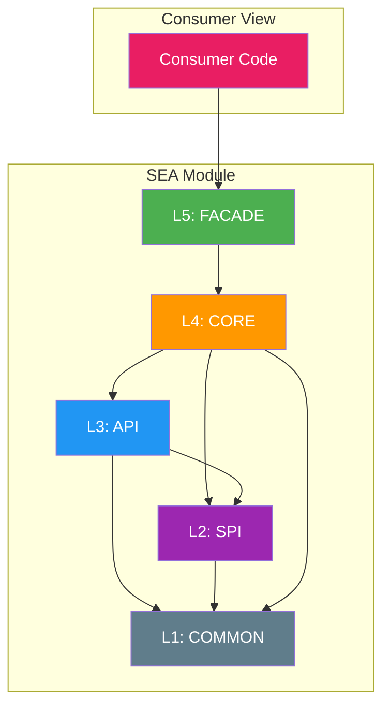
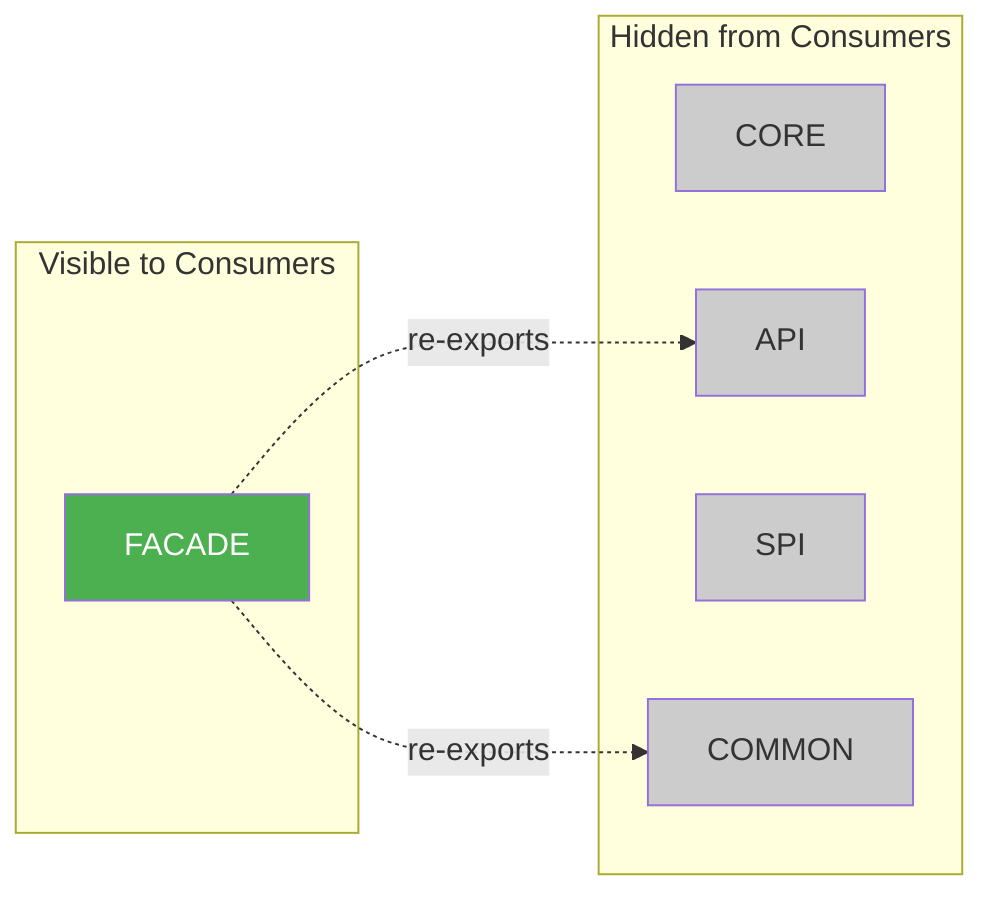

# SEA Layer Dependencies

## Dependency Rules

| Layer | Can Depend On |
|-------|---------------|
| FACADE (L5) | CORE |
| CORE (L4) | API, SPI, COMMON |
| API (L3) | SPI, COMMON |
| SPI (L2) | COMMON |
| COMMON (L1) | External only |

## Visibility

