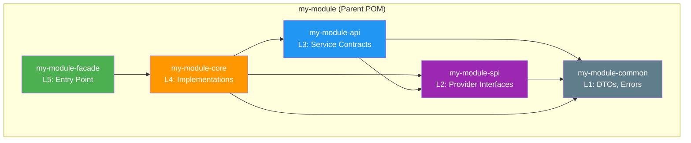
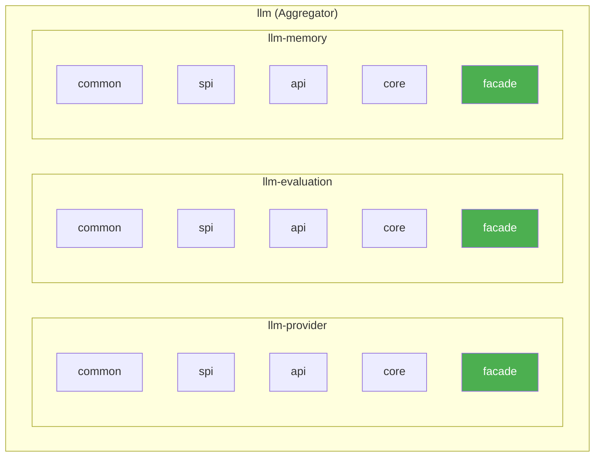
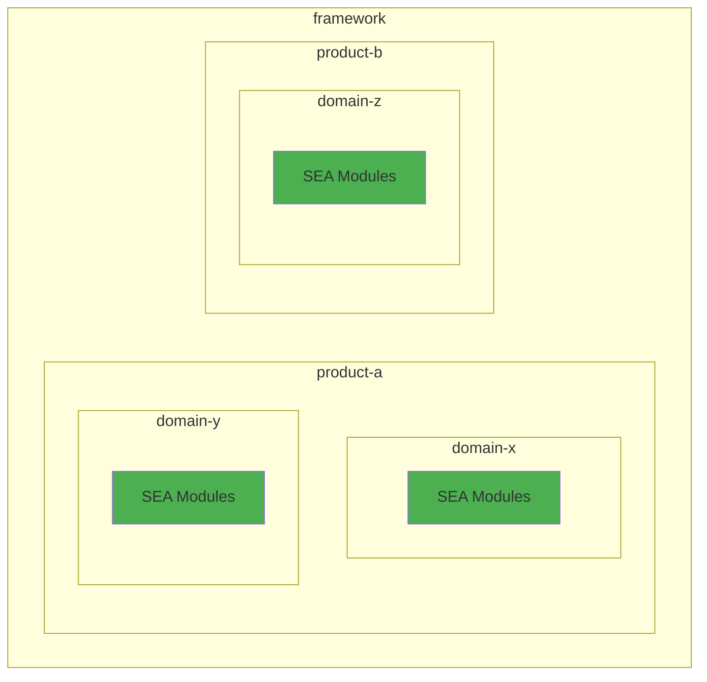
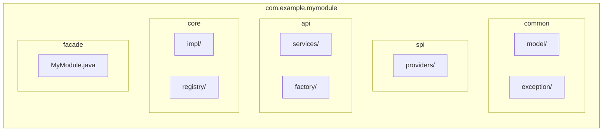
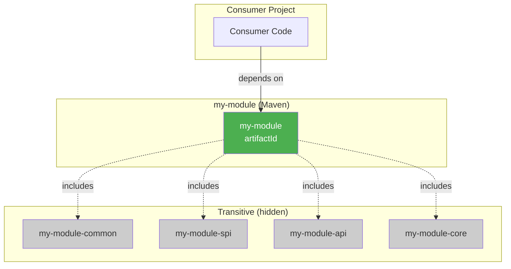

# SEA Module Structure

## Single Module (Depth 0)



## Domain with Capabilities (Depth 1)



## Framework Structure (Depth 2)



## Package Organization



## Consumer Dependency View



## Maven Module Hierarchy

```
my-module/
├── pom.xml                     # packaging: pom
│   └── <modules>
│       ├── my-module-common
│       ├── my-module-spi
│       ├── my-module-api
│       ├── my-module-core
│       └── my-module-facade
│
├── my-module-common/
│   └── pom.xml                 # artifactId: my-module-common
│
├── my-module-spi/
│   └── pom.xml                 # artifactId: my-module-spi
│
├── my-module-api/
│   └── pom.xml                 # artifactId: my-module-api
│
├── my-module-core/
│   └── pom.xml                 # artifactId: my-module-core
│
└── my-module-facade/
    └── pom.xml                 # artifactId: my-module (NOT -facade!)
```
