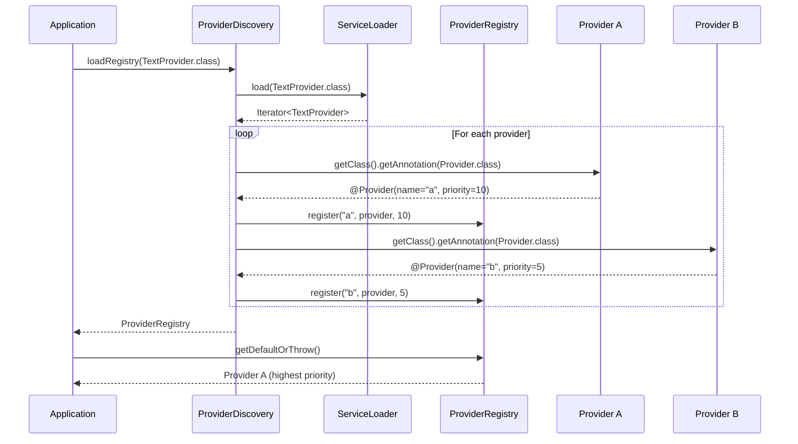
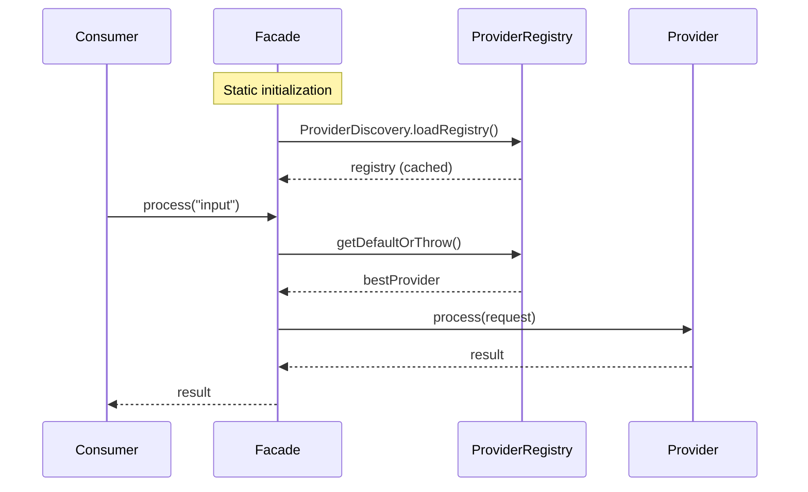
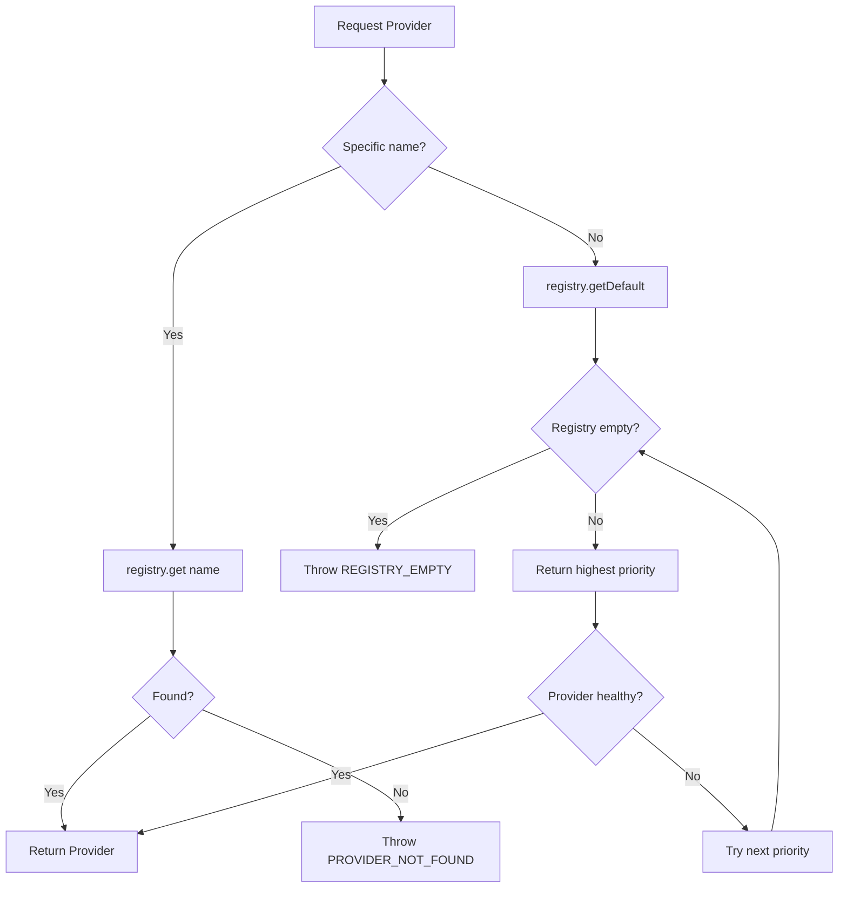
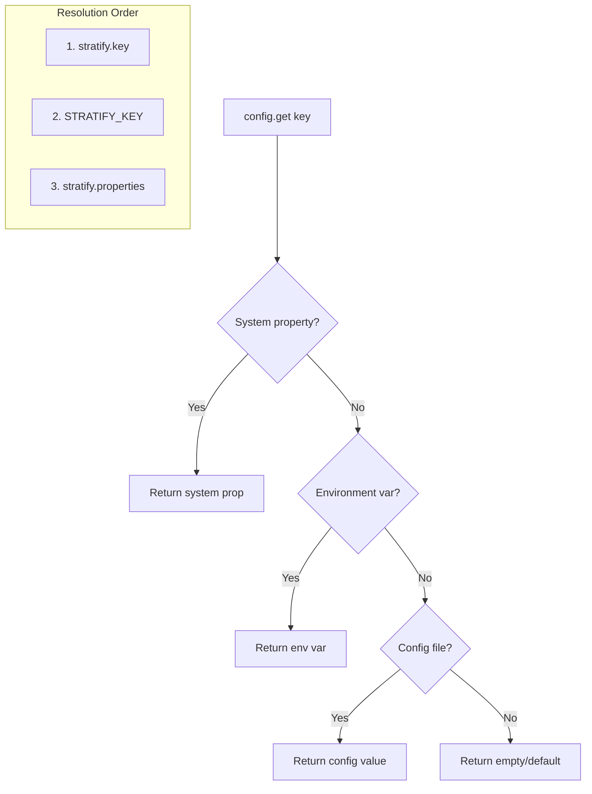

# Provider Discovery Flow

## Discovery Sequence

```mermaid
sequenceDiagram
    participant App as Application
    participant PD as ProviderDiscovery
    participant SL as ServiceLoader
    participant PR as ProviderRegistry
    participant P1 as Provider A
    participant P2 as Provider B

    App->>PD: loadRegistry(TextProvider.class)
    PD->>SL: load(TextProvider.class)
    SL-->>PD: Iterator<TextProvider>

    loop For each provider
        PD->>P1: getClass().getAnnotation(Provider.class)
        P1-->>PD: @Provider(name="a", priority=10)
        PD->>PR: register("a", provider, 10)

        PD->>P2: getClass().getAnnotation(Provider.class)
        P2-->>PD: @Provider(name="b", priority=5)
        PD->>PR: register("b", provider, 5)
    end

    PD-->>App: ProviderRegistry

    App->>PR: getDefaultOrThrow()
    PR-->>App: Provider A (highest priority)
```

## Facade Usage Flow

```mermaid
sequenceDiagram
    participant C as Consumer
    participant F as Facade
    participant PR as ProviderRegistry
    participant P as Provider

    Note over F: Static initialization
    F->>PR: ProviderDiscovery.loadRegistry()
    PR-->>F: registry (cached)

    C->>F: process("input")
    F->>PR: getDefaultOrThrow()
    PR-->>F: bestProvider
    F->>P: process(request)
    P-->>F: result
    F-->>C: result
```

## Provider Selection

```mermaid
flowchart TD
    A[Request Provider] --> B{Specific name?}
    B -->|Yes| C[registry.get name]
    B -->|No| D[registry.getDefault]

    C --> E{Found?}
    E -->|Yes| F[Return Provider]
    E -->|No| G[Throw PROVIDER_NOT_FOUND]

    D --> H{Registry empty?}
    H -->|Yes| I[Throw REGISTRY_EMPTY]
    H -->|No| J[Return highest priority]

    J --> K{Provider healthy?}
    K -->|Yes| F
    K -->|No| L[Try next priority]
    L --> H
```

## Configuration Resolution

```mermaid
flowchart TD
    A[config.get key] --> B{System property?}
    B -->|Yes| C[Return system prop]
    B -->|No| D{Environment var?}

    D -->|Yes| E[Return env var]
    D -->|No| F{Config file?}

    F -->|Yes| G[Return config value]
    F -->|No| H[Return empty/default]

    subgraph "Resolution Order"
        I[1. stratify.key]
        J[2. STRATIFY_KEY]
        K[3. stratify.properties]
    end
```
