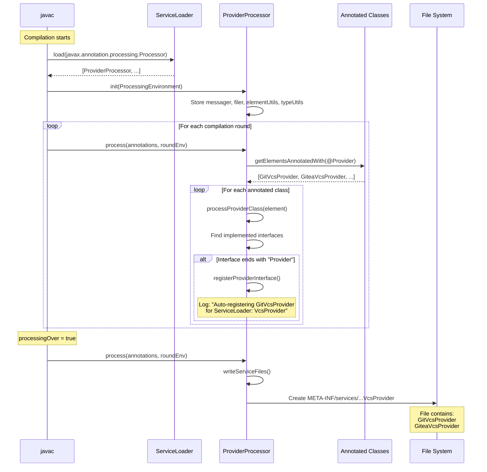
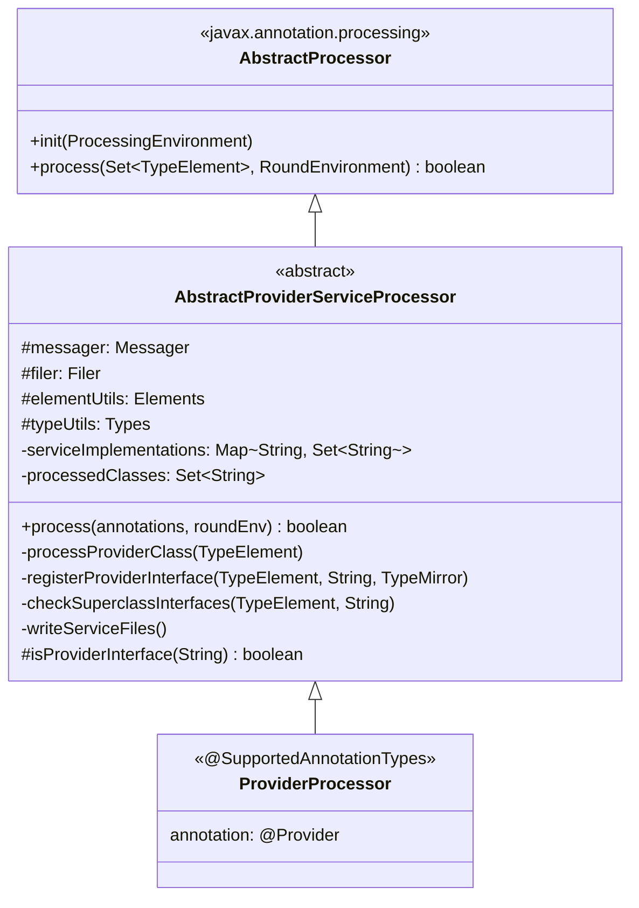

# Compile-Time Service Registration

## Overview

Stratify uses **Java Annotation Processing (JSR 269)** to automatically generate `META-INF/services` files at compile time. This eliminates manual service file maintenance and ensures ServiceLoader can discover provider implementations.

## How It Works

### Processor Discovery

All processors are registered via ServiceLoader so `javac` discovers them automatically:

```
stratify-processor/src/main/resources/
└── META-INF/services/
    └── javax.annotation.processing.Processor
        └── dev.engineeringlab.stratify.processor.ProviderProcessor
```

### Compile-Time Flow



## Processing Steps

### Step 1: Processor Discovery

`javac` discovers processors via `javax.annotation.processing.Processor` ServiceLoader:

```java
// javac internally does something like:
ServiceLoader<Processor> processors = ServiceLoader.load(Processor.class);
for (Processor p : processors) {
    p.init(processingEnv);
}
```

### Step 2: Annotation Scanning

For each annotated class (e.g., `@Provider`):

```java
@Provider(name = "git", priority = 15)
public class GitVcsProvider implements VcsProvider {
    // ...
}
```

The processor:

1. **`processProviderClass()`** - Finds all implemented interfaces
2. **Checks interface name** - If it ends with `Provider`, it's registered
3. **`registerProviderInterface()`** - Logs and stores the mapping:
   ```
   Auto-registering dev.engineeringlab.vcs.core.git.GitVcsProvider
   for ServiceLoader: dev.engineeringlab.vcs.VcsProvider
   ```

### Step 3: Service File Generation

After processing all rounds, `writeServiceFiles()` creates:

```
target/classes/META-INF/services/dev.engineeringlab.vcs.VcsProvider
```

Contents:
```
# Auto-generated by ProviderProcessor - DO NOT EDIT
# Provider implementations discovered at compile time
dev.engineeringlab.vcs.core.git.GitVcsProvider
dev.engineeringlab.vcs.core.gitea.GiteaVcsProvider
```

## Class Diagram



## Key Components

### AbstractProviderServiceProcessor

The base class that handles all the processing logic:

| Method | Purpose |
|--------|---------|
| `process()` | Main entry point called by javac |
| `processProviderClass()` | Scans a class for provider interfaces |
| `registerProviderInterface()` | Records implementation → interface mapping |
| `checkSuperclassInterfaces()` | Handles inherited interfaces |
| `writeServiceFiles()` | Generates META-INF/services files |
| `isProviderInterface()` | Determines if interface should be registered (default: ends with "Provider") |

### ProviderProcessor

A minimal subclass that specifies which annotation to process:

```java
@SupportedAnnotationTypes("dev.engineeringlab.stratify.annotation.Provider")
@SupportedSourceVersion(SourceVersion.RELEASE_21)
public class ProviderProcessor extends AbstractProviderServiceProcessor {
    // All logic is in the base class
}
```

## Creating Domain-Specific Processors

To create a processor for a new annotation (e.g., `@CacheProvider`):

```java
@SupportedAnnotationTypes("com.example.annotation.CacheProvider")
@SupportedSourceVersion(SourceVersion.RELEASE_21)
public class CacheProviderProcessor extends AbstractProviderServiceProcessor {
    // Optionally override isProviderInterface() for custom logic
}
```

Register in `META-INF/services/javax.annotation.processing.Processor`:
```
com.example.processor.CacheProviderProcessor
```

## Build Output Example

During Maven compilation:

```
[INFO] --- compiler:3.14.0:compile (default-compile) @ vcs-core ---
[INFO] Compiling 8 source files with javac [debug release 21] to target/classes
[INFO] .../GitVcsProvider.java:[56,8] Auto-registering
       dev.engineeringlab.vcs.core.git.GitVcsProvider for ServiceLoader:
       dev.engineeringlab.vcs.VcsProvider
[INFO] .../GiteaVcsProvider.java:[66,8] Auto-registering
       dev.engineeringlab.vcs.core.gitea.GiteaVcsProvider for ServiceLoader:
       dev.engineeringlab.vcs.VcsProvider
[INFO] Generated META-INF/services/dev.engineeringlab.vcs.VcsProvider
       with 2 implementation(s)
```

## Benefits

| Benefit | Description |
|---------|-------------|
| **Zero manual maintenance** | No need to manually edit service files |
| **Compile-time validation** | Errors caught early if annotation is misconfigured |
| **Convention-based** | Any interface ending in `Provider` is auto-registered |
| **Inheritance-aware** | Checks superclass interfaces too |
| **Refactoring-safe** | Package moves automatically update service files |

## Related Documentation

- [Provider Discovery Flow](./provider-discovery-flow.md) - Runtime discovery sequence
- [Module Structure](./module-structure.md) - SEA layer organization
