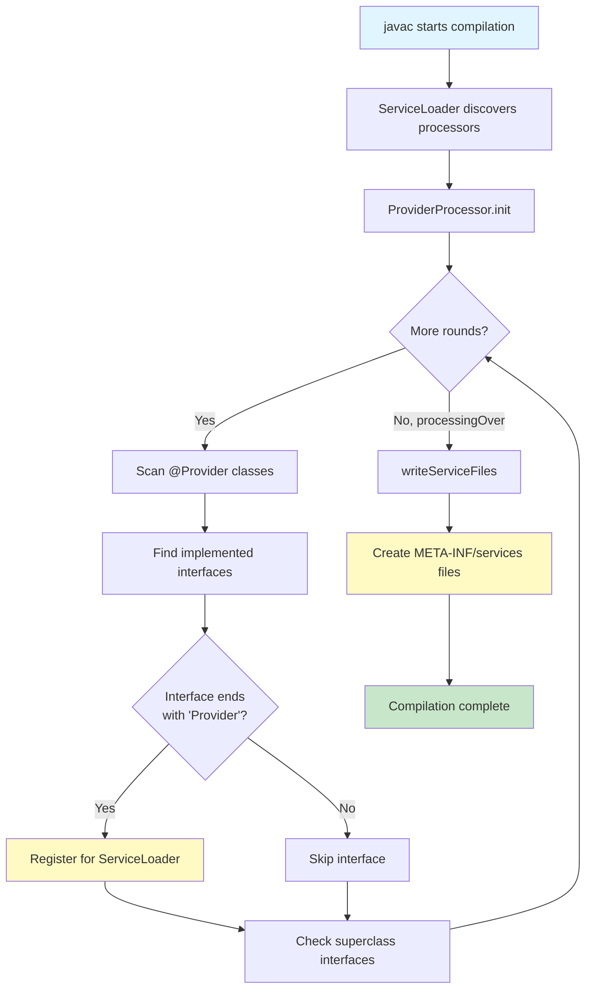
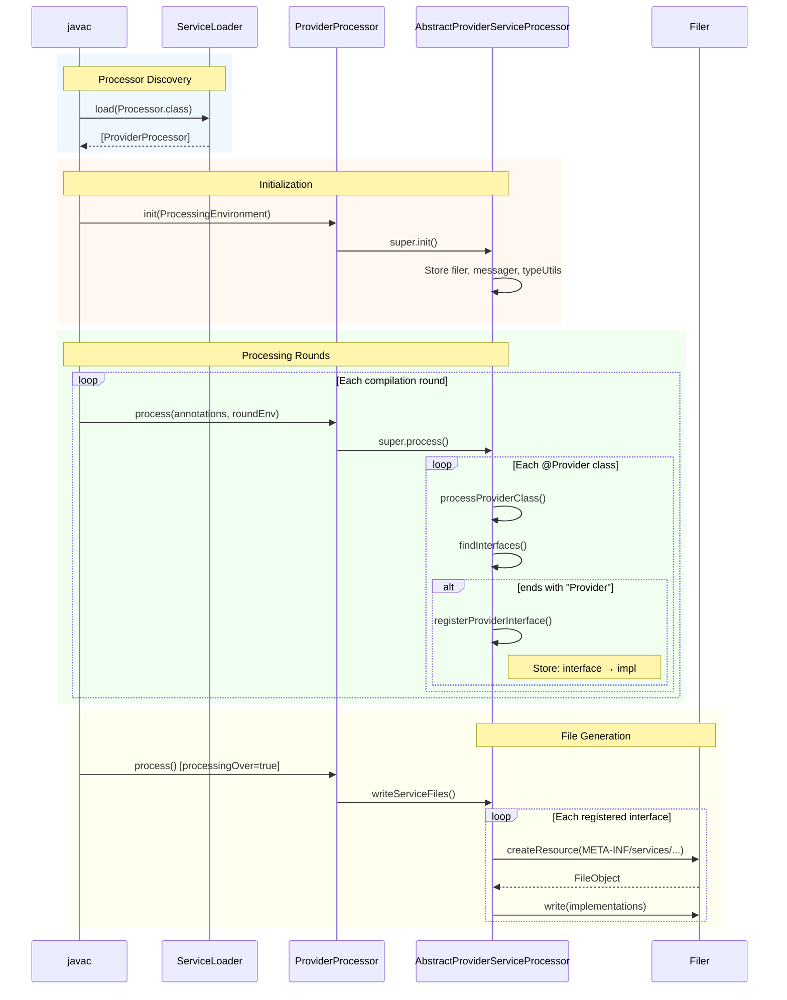

# Stratify Processor Architecture

## Overview

The `stratify-processor` module provides compile-time annotation processing to auto-generate `META-INF/services` files for Java ServiceLoader discovery.

## Module Structure

```
stratify-processor/
├── doc/
│   └── 3-design/
│       ├── architecture.md          # This file
│       └── annotation-processing.md # Detailed processing flow
├── pom.xml
└── src/main/
    ├── java/dev/engineeringlab/stratify/processor/
    │   ├── AbstractProviderServiceProcessor.java
    │   ├── ProviderProcessor.java
    │   └── package-info.java
    └── resources/META-INF/services/
        └── javax.annotation.processing.Processor
```

## Component Architecture

```mermaid
graph TB
    subgraph "stratify-processor"
        PP[ProviderProcessor]
        APSP[AbstractProviderServiceProcessor]

        PP -->|extends| APSP
    end

    subgraph "javax.annotation.processing"
        AP[AbstractProcessor]
        PE[ProcessingEnvironment]
        RE[RoundEnvironment]
        F[Filer]
        M[Messager]
    end

    subgraph "stratify-annotations"
        PA[@Provider]
    end

    APSP -->|extends| AP
    APSP -->|uses| PE
    APSP -->|uses| RE
    APSP -->|writes via| F
    APSP -->|logs via| M
    PP -->|processes| PA
```

## Processing Workflow



## Sequence Diagram



## Class Responsibilities

| Class | Responsibility |
|-------|----------------|
| `AbstractProviderServiceProcessor` | Base class with all processing logic |
| `ProviderProcessor` | Binds to `@Provider` annotation |

## Extension Points

To support a new provider annotation:

```java
@SupportedAnnotationTypes("com.example.MyProvider")
@SupportedSourceVersion(SourceVersion.RELEASE_21)
public class MyProviderProcessor extends AbstractProviderServiceProcessor {

    @Override
    protected boolean isProviderInterface(String name) {
        // Custom logic if needed
        return name.endsWith("Provider") || name.endsWith("Service");
    }
}
```

## Related Documentation

- [Annotation Processing Details](./annotation-processing.md) - Step-by-step processing flow
